------

<h1 align = "center">markdown基本语法🚀</h1>

<div style="text-align: right; color: Purple; font-size: 18px;">
    <span style="font-weight: bold; font-style: italic; text-decoration: underline;">
        <a href="https://github.com/kestlermai" style="color: Purple;">--by:maihuanzhuo</a>
    </span>
</div>


## 一、标题

> 快捷键：ctrl+数字=标题级别

|  命令  |   描述   |
| :----: | :------: |
|   #    | 一级标题 |
|   ##   | 二级标题 |
|  ###   | 三级标题 |
|  ####  | 四级标题 |
| #####  | 五级标题 |
| ###### | 六级标题 |

---

## 二、引用

> 命令：'>'加上引用内容；快捷键：Ctrl + Shift + Q ；退出引用：Shift + Tab

🙌示例：

> 这是麦焕焯的笔记

也可以多重嵌套引用：

🙌示例：

```tex
>这是麦焕焯的笔记

>这是麦焕焯的笔记
>>这是麦焕焯的笔记
>>>这是麦焕焯的笔记
```

🙌效果：

> 这是麦焕焯的笔记

>这是麦焕焯的笔记
>
>> 这是麦焕焯的笔记
>>
>>> 这是麦焕焯的笔记

---

## 三、列表

### 1.有序列表

> 命令：用'1.','2.'.....表示，快捷键：Ctrl + Shift + [
>
> 降级快捷键：Tab 或 Shift + ]
>
> 升级快捷键：Shift + Tab 或 Shift + [

🙌安装R studio步骤：

1. 安装r-base
2. 安装r-studio
3. 安装rtools

### 2.无序列表

> 命令：用’-‘或者’*‘加空格表示，快捷键：Ctrl + Shift + ]

🙌安装R studio步骤：

- 安装r-base

- 安装r-studio

- 安装rtools


> 同时也可以展现不同子列表：用多个’-‘或者’*‘加空格表示，快捷键：Shift + Tab 或 Shift + ]

🙌安装R studio步骤：

* 安装r-base
* * 安装r-studio

* * * 安装rtools

> 如果想结束有序或无序列表，用 Ctrl + ] 即可

🙌安装R studio步骤：

* 安装r-base
* -  安装r-studio
  - - 安装rtools

结束

### 3.任务列表

> 命令：- [ ] ，快捷键：Ctrl + Shift + X

🙌安装R studio步骤：

- [x] 安装r-base

- [x] 安装r-studio

- [x] 安装rtools

---

## 四、表格

> 命令：|xx|xx|xx|
>
> 左对齐：|:---|:---|:---|
>
> 右对齐：|---:|---:|---:|
>
> 居中：|:---:|:---:|:---:|

```tex
|日期|地点|纬度|
|:---:|:---:|:---:|
|2021-01-19|北京|北纬39.4|
|2022-02-19|上海|北纬31.1|
|2023-03-19|广州|北纬22.3|
|2024-04-19|深圳|北纬22.3|
```

|    日期    | 地点 |   纬度   |
| :--------: | :--: | :------: |
| 2021-01-19 | 北京 | 北纬39.4 |
| 2022-02-19 | 上海 | 北纬31.1 |
| 2023-03-19 | 广州 | 北纬22.3 |
| 2024-04-19 | 深圳 | 北纬22.3 |

- [x] 快捷键：Ctrl + T
- [x] 添加行：Ctrl + Enter
- [x] 删除行：Ctrl + Shift + Backspace（即删除键，左的箭头"←"）
- [x] `Alt` + `↑`   将表格该行上移，`↓` 将该行下移
- [x] `Alt` + `←`   将表格该列左移，`→` 将该列右移

---

## 五、代码

### 1.代码块

> 命令：```，快捷键：Ctrl + Shift + K，退出快捷键：Ctrl + Enter

```c
#include<stdio.h>
int main()
{
    printf("hello world!\n");
    return 0;
}
```

### 2.行内代码

> 命令：\`代码\` ; 快捷键：Ctrl + Shift + `

`print("hello world!") `

---

## 六、数学公式

### 1.公式块

> 命令： “$$” + 回车；快捷键：Ctrl + Shift + M

```tex
$$
e^{i\pi + 1} = 2
$$
```


$$
e^{i\pi + 1} = 2
$$

### 2.行内公式

> 命令： “$ $”

```tex
$ e^{i\pi + 1} = 2 \$
```

$ e^{i\pi + 1} = 2 $

---

## 七、元素

### 1.插入图片

> 命令： \!\[图片名词]\(图片路径)；快捷键：Ctrl + Shift + I

```tex
示例：
```


#### 🌳修改图片大小

> 使用代码插入：\    # 拷贝url后，更改width与height即可

### 2.超链接

> 命令： \[显示内容](网址) ; 快捷键：Ctrl + K

```tex
示例：[GitHub](https://github.com/)  [ChatGPT (openai.com)](https://chat.openai.com/)
```

[GitHub](https://github.com/) [ChatGPT (openai.com)](https://chat.openai.com/)

- [x] 打开网站：Ctrl + 左键单击（在typora下）

### 3.引用链接

> 命令： \[显示内容][引用路径]
>
> [引用：路径 "描述"    /* typora下点击链接的时候需要按ctrl键 */

```tex
示例： [maomao][maomao]
[maomao]:C:\Users\maihuanzhuo\Desktop\猫猫.jpg"maomao"
```

[maomao][maomao]

[maomao]: C:\Users\maihuanzhuo\Desktop\猫猫.jpg "maomao"

### 4.水平分割线

> 命令： --- ； 

---

## 八、样式

### 1.字体加粗

> 命令：\**加粗** 或者 \__加粗__； 快捷键：Ctrl + B

🙌示例：**麦焕焯**

### 2.字体斜体

> 命令：\*斜体* 或者 \_斜体_；快捷键：Ctrl + I ；快捷键：Ctrl + I

🙌示例：*麦焕焯*

> 字体加粗+斜体 ：\*\*\*文字*** 或者 \_\_\_文字___   

🙌示例：***麦焕焯***

### 3.字体高亮

> 命令： \=\=高亮== ; 

🙌示例：==麦焕焯==

### 4.下划线

> 命令： \<u>下划线内容</u>    快捷键：Ctrl + U

🙌示例：<u>麦焕焯</u>

### 5.删除线

> 命令：\~\~删除线内容~~      快捷键：Alt + Shift + 5

🙌示例：~~麦焕焯~~

### 6.下标

> 命令： \~小标内容~ 

🙌示例：H~2~O

### 7.上标

> 命令：\^上标内容^

🙌示例：x^2^

### 8.添加表情

> 命令：\:smile:  快捷键：win + 句号

🙌示例：😂🤣❤️😍😘💕😁👍🙌👌

### 9.脚注（尾注）

> 命令：\[^xx]

```tex
麦焕焯[^xx]
[^xx]:这是脚注内容
```

🙌示例：

麦焕焯[^xx]

[^xx]:这是脚注内容

### 10.字体颜色

> 命令： \$\textcolor{颜色名称}{字符}$

```tex
示例：$\textcolor{GreenYellow}{麦焕焯}$
```

$\textcolor{GreenYellow}{麦焕焯}$

> typora字体配色模板引用自：https://blog.csdn.net/liulei952413829/article/details/114670380

### 11.换行

> 命令：\<br> 或者直接空格回车键也可以

🙌示例：

麦<br>焕焯

### 12.标题和文字居中

> 命令： \<h1 align = "center">标题居中</h1>  #可选left（默认）、right、center

🙌示例：

 <h1 align = "center">标题居中</h1> 

> 命令： \<center>文字居中</center>   #但是html中没有\<right>命令

```html
<div style="text-align: right; color: Purple; font-size: 20px;">
    <span style="font-weight: bold; font-style: italic; text-decoration: underline;">
        文字偏左
    </span>
</div>
```

🙌示例：

<div style="text-align: right; color: Purple; font-size: 16px;">
    <span style="font-weight: bold; font-style: italic; text-decoration: underline;">
        文字偏左
    </span>
</div>

---

## 九、绘图（mermaid语法）

~~~tex
用法：
```mermaid
    %% 此处内容会渲染成mermaid图形，Mermaid图表中的注释可以使用%%来添加，同时注释需要独占一行
```
或者直接在代码块定义mermaid语法
~~~

### 1.流程图（graph or flowchart）

> 使用***graph***或***flowchart***关键字来定义流程图

🙌示例：

````

````


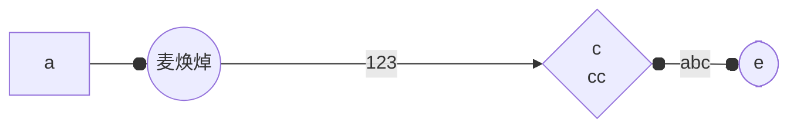

#### 🌳流程图方向

|   样式   |              描述               |
| :------: | :-----------------------------: |
| graph TB | top to bottom（从上到下，默认） |
| graph TD |    top-down（也是从上到下）     |
| graph BT |    bottom to top（从下到上）    |
| graph RL |    right to left（从右到左）    |
| graph LR |    left to right（从左到右）    |

#### 🌳结点样式

|  id样式   |                描述                |
| :-------: | :--------------------------------: |
|   id[A]   |          矩形结点（默认）          |
|   id(A)   | 圆角矩形结点（也可以叫圆角矩形框） |
|  id((A))  |              圆形结点              |
|   id{A}   |              棱形结点              |
|  id{{A}}  |             六边形结点             |
|  id >A]   |         开口向右的旗帜结点         |
| id[/A\\]  |                梯形                |
|  id[\A/]  |               倒梯形               |
| id[\\A\\] |             平行四边形             |
|  id[/A/]  |           反向平行四边形           |
|  id[[A]]  |             子程序节点             |


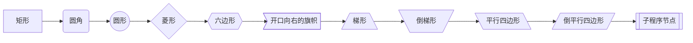

#### 🌳自定义节点样式

```tex
graph LR
	a(a) --> b(b)
	style a fill:#f9f,stroke:#333,stroke-width:4px
	style b fill:#bbf,stroke:#f66,stroke-width:2px,color:#fff,stroke-dasharray:5 5
```


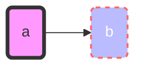

#### 🌳连接线样式

| 线的样式 |              含义              |
| :------: | :----------------------------: |
|   -->    | 带箭头的实线（短线越多线越长） |
| --aa-->  |       中间可以添加文字aa       |
|  - . -   |     虚线 （虚线不能延长）      |
|  - . ->  |       虚线 （不能延长）        |
| -.- -.-> | 中间可以添加文字 （不能延长）  |
|   ==>    |     带箭头的粗线（可延长）     |
|   ===    |        粗线 （可延长）         |


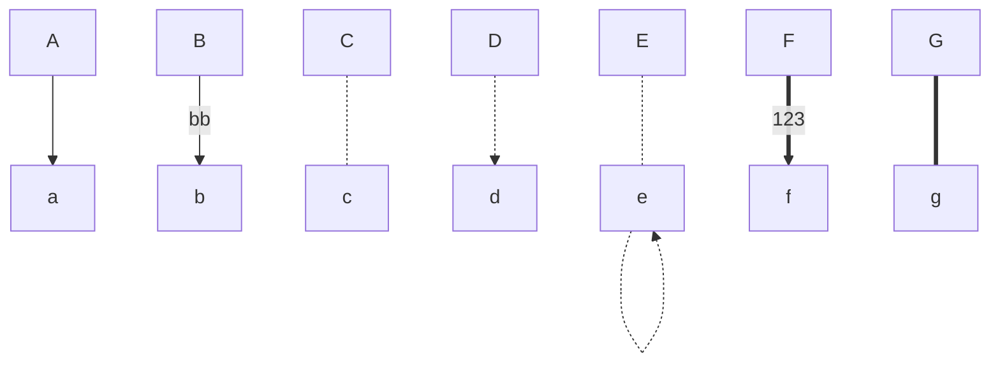

- [x] `|文本|`：表示条件分支的判断条件和文本

#### 🌳连接头样式

```
graph LR
	a o---o b
	b <---> c
	c x---x d
```


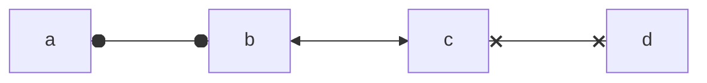

#### 🌳子图表（subgraph）

```
graph LR
	开头 --- a((a))
	subgraph 子图表名称
		a --> b
		a --> bbb
	end
	b --> c
	bbb --> c
	style 开头 fill:#bbf,stroke:#f66,stroke-width:2px,color:#fff,stroke-dasharray:5 5
```


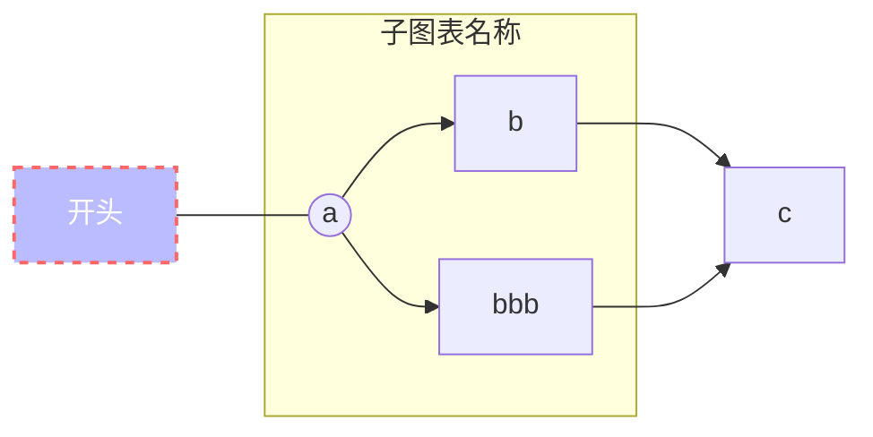

---


### 2.序列图（sequenceDiagram）

>  sequenceDiagram：描述对象之间交互顺序的图表

#### 🌳常见语法

- [x] `:` 表示消息的内容
- [x] `->>` 表示从左到右的箭头
- [x] `-->>` 用于时序图中的回复内容
- [x] `--x` 末端为叉的实线或虚线（表示异步）
- [x] `Note` 用于添加注释，right of，left of，over（在当中，可以横跨多个参与者）
- [x] `activate` 参与者，说明某个参与者进入“处理中”状态
- [x] 在消息线末尾增加 `+` ，则消息接收者进入当前消息的“处理中”状态；
- [x] 在消息线末尾增加 `-` ，则消息接收者离开当前消息的“处理中”状态。

#### 🌳循环

```
loop 循环的条件
    循环体描述语句
end
```

#### 🌳判断

```
alt 条件 1 描述
    分支 1 描述语句
else 条件 2 描述 # else 分支可选
    分支 2 描述语句
else ...
    ...
end
```

#### 🌳可选情况

```
opt 条件描述
    分支描述语句
end
```

🙌示例：

```
sequenceDiagram
	a ->> b: 你叫什么名字？
	loop 对话回复
		activate b
		Note right of b: 想一下
		alt 状态1
		b -x a: 我叫麦焕焯
		else 状态2
		b -x a: 我叫ChatGPT
		end
		opt 额外回复
        a --> b: 好的，我记录下来了
		end
	end
	Note left of a: 简单对话
```


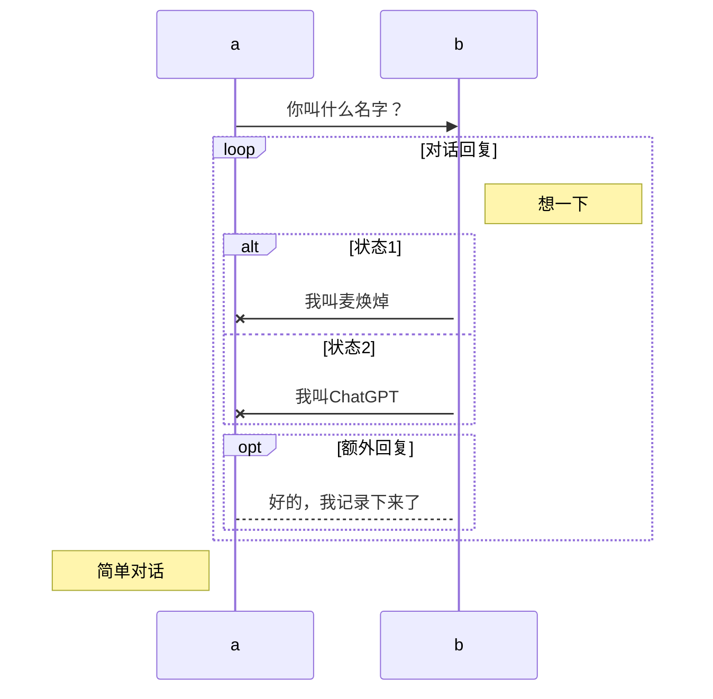

---


### 3.类图（classDiagram）

> classDiagram 用于展示系统中的类及其之间的关系

#### 🌳定义一个类别

- 使用关键字 class（如 `class Animal`）来定义 Animal 类

- 通过一次定义两个类及其关系的关系。例如，`Animal <|-- dog`。

```
classDiagram
    direction RL
    class Animal
    Animal <|-- dog
    style Animal fill:#bbf,stroke:#f66,stroke-width:2px,color:#fff,stroke-dasharray: 5 5(要求v10.7.0+)
```

🙌示例：


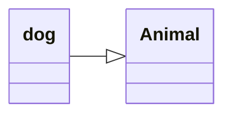

#### 🌳类别标签

- 类别标签  `class Animal["Animal with a label"]` ` class Car["Car with *! symbols"]`

🙌示例：


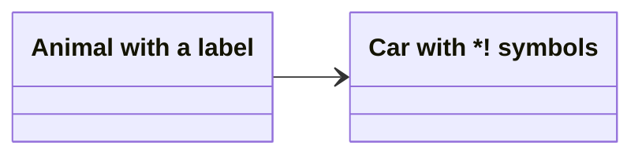

#### 🌳定义类的成员

- Mermaid 根据括号 `()` 是否存在来区分属性和函数/方法
- 使用 `{}` 括号关联类的成员，其中成员分组在大括号内。适合一次定义多个成员。

```
classDiagram
	class Animal
	Animal : +Dog
	Animal : +Wolf
	Animal : +Cat(Felidae)
	Animal : +Tiger(Felidae)
classDiagram
    class Animal{
        +Dog
        +Wolf
        +Cat(Felidae)
        +Tiger(Felidae)
    }
```

🙌示例：


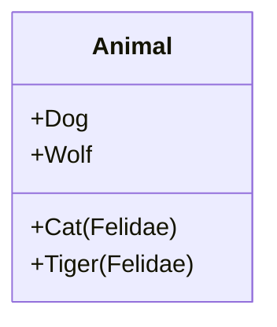


#### 🌳定义关系

|   类型   |             描述              |
| :------: | :---------------------------: |
|  `<|--`  |      继承（Inheritance）      |
|  `*--`   |      作品（Composition）      |
|  `o--`   |      聚合（Aggregation）      |
|  `-->`   |      关联（Association）      |
|   `--`   |    链接（实心）Link(Solid)    |
|  `..>`   |      依赖（Dependency）       |
|  `..|>`  |      实现（Realization）      |
|   `..`   |   链接（虚线）Link(Dashed)    |
| `<|--|>` | 双向关系（Two-way relations） |

🙌示例：


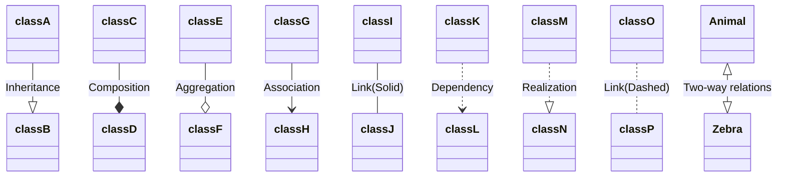

#### 🌳定义命名空间

- 命名空间对类进行分组

```
classDiagram
	direction RL
    namespace Mammals {
        class Canidae{
        Dog
       	Wolf()
        }
        class Felidae {
        Cat
        Tiger()
        }
    }
    Canidae <|--|> Felidae
    Canidae --> Animal
    Felidae --> Animal
```

🙌示例：


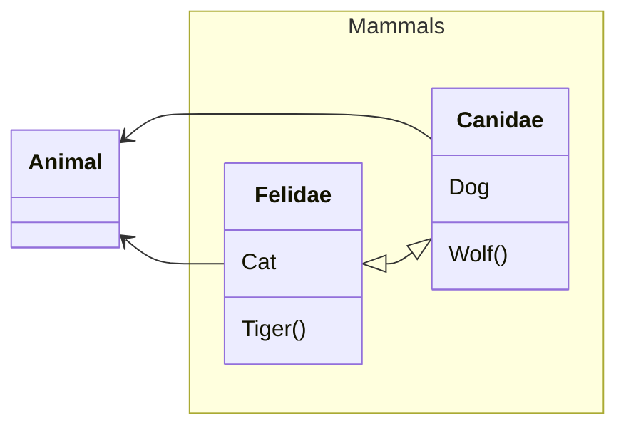

---


### 4.甘特图（Gantt diagram）

> 用于项目进度表以及任何一个项目完成所需的时间

#### 🌳基本语法

| 元数据语法                                 |               开始日期               |              结束日期              |    ID    |
| ------------------------------------------ | :----------------------------------: | :--------------------------------: | :------: |
| `<taskID>, <startDate>, <endDate>`         | 使用 `dateformat` 解释的 `startdate` | 使用 `dateformat` 解释的 `endDate` | `taskID` |
| `<taskID>, <startDate>, <length>`          | 使用 `dateformat` 解释的 `startdate` |        开始日期 + `length`         | `taskID` |
| `<taskID>, after <otherTaskId>, <endDate>` | 先前指定任务的结束日期 `otherTaskID` | 使用 `dateformat` 解释的 `endDate` | `taskID` |
| `<taskID>, after <otherTaskId>, <length>`  | 先前指定任务的结束日期 `otherTaskID` |        开始日期 + `length`         | `taskID` |
| `<startDate>, <endDate>`                   | 使用 `dateformat` 解释的 `startdate` | 使用 `dateformat` 解释的 `enddate` |   n/a    |
| `<startDate>, <length>`                    | 使用 `dateformat` 解释的 `startdate` |        开始日期 + `length`         |   n/a    |
| `after <otherTaskID>, <endDate>`           | 先前指定任务的结束日期 `otherTaskID` | 使用 `dateformat` 解释的 `enddate` |   n/a    |
| `after <otherTaskID>, <length>`            | 先前指定任务的结束日期 `otherTaskID` |        开始日期 + `length`         |   n/a    |
| `<endDate>`                                |          上一任务的结束日期          | 使用 `dateformat` 解释的 `enddate` |   n/a    |
| `<length>`                                 |          上一任务的结束日期          |        开始日期 + `length`         |   n/a    |

#### 🌳章节陈述

- `Section statements`

#### 🌳里程碑

- 有效标签 `active`(活动)、`done`（完成）、`crit`（临界） 和 `milestone`（里程碑）

```
gantt
	section A section
	%% apple任务被命名为a，时间从2017-07-20开始，持续1 week
    apple :a, 2017-07-20, 1w 
   %% banana任务被命名为b，时间从2017-07-23开始，持续1 day，并且属性为临界
    banana :crit, b, 2017-07-23, 1d

   section B section
   %% cherry任务被命名为c，时间是从b和a任务结束后时间开始，持续1 day，并且属性为活动
   cherry :active, c, after b a, 1d
```

🙌示例：


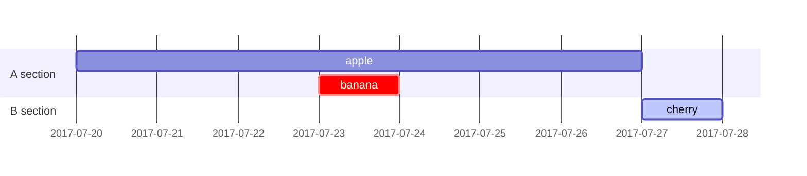

#### 🌳设置日期格式

```
dateFormat YYYY-MM-DD
```

#### 🌳设置轴上的日期格式

``` 
axisFormat %Y-%m-%d
```

```
gantt
	title GANTT diagram
    dateFormat HH:mm
    axisFormat %H:%M
    Initial milestone : milestone, m1, 17:49, 2m
    Task A : 10m
    Task B : 5m
    Final milestone : milestone, m2, 18:08, 4m
```

🙌示例：


```mermaid
gantt
	title GANTT diagram
	dateFormat HH:mm
    axisFormat %H:%M
    Initial milestone : milestone, m1, 17:49, 2m
    Task A : 10m
    Task B : 5m
    Final milestone : milestone, m2, 18:08, 4m
```

```
gantt
    dateFormat  YYYY-MM-DD
    title       Adding GANTT diagram functionality to mermaid
    excludes    weekends
    %% (`excludes` accepts specific dates in YYYY-MM-DD format, days of the week ("sunday") or "weekends", but not the word "weekdays".)

    section A section
    Completed task            :done,    des1, 2014-01-06,2014-01-08
    Active task               :active,  des2, 2014-01-09, 3d
    Future task               :         des3, after des2, 5d
    Future task2              :         des4, after des3, 5d

    section Critical tasks
    Completed task in the critical line :crit, done, 2014-01-06,24h
    Implement parser and jison          :crit, done, after des1, 2d
    Create tests for parser             :crit, active, 3d
    Future task in critical line        :crit, 5d
    Create tests for renderer           :2d
    Add to mermaid                      :1d
    Functionality added                 :milestone, 2014-01-25, 0d

    section Documentation
    Describe gantt syntax               :active, a1, after des1, 3d
    Add gantt diagram to demo page      :after a1  , 20h
    Add another diagram to demo page    :doc1, after a1  , 48h

    section Last section
    Describe gantt syntax               :after doc1, 3d
    Add gantt diagram to demo page      :20h
    Add another diagram to demo page    :48h
```

🙌示例：


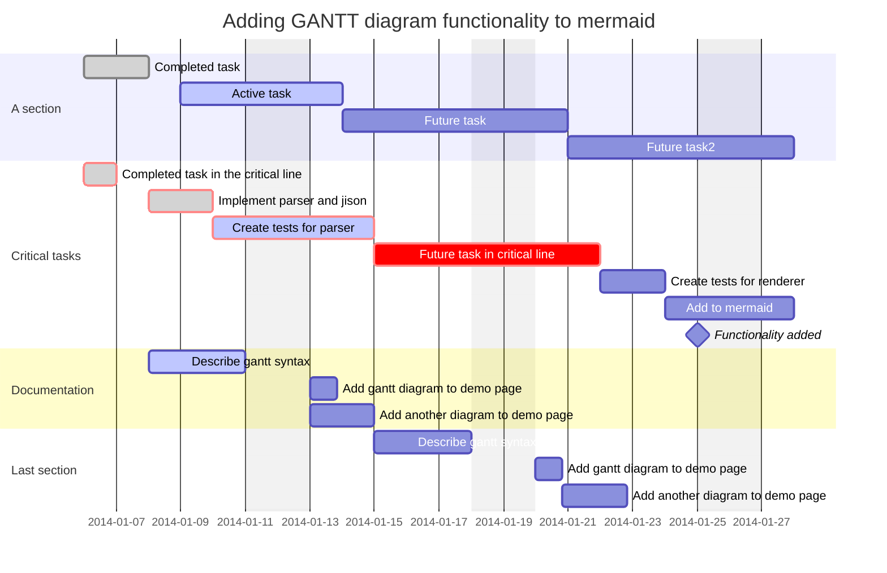

---


### 5.饼图（Pie Chart）

> 展示不同部分之间的占比关系，数据不用额外处理，使用rawdata同样会自动计算占比

```
pie 
	title Programming Language Rankings
	"Python" : 13.33
	"C" : 11.41
	"C++" : 10.63
 	"Java" : 10.33
 	"others":54.3
```

🙌示例：


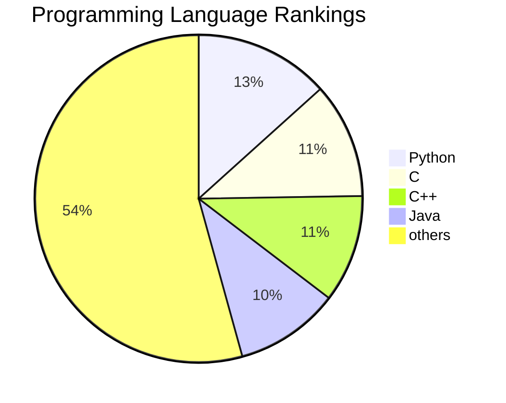

---


### 6.象限图（quadrantChart）

> 象限图是分为四个象限的数据的直观表示。它用于在二维网格上绘制数据点，其中一个变量表示在 x 轴上，另一个变量表示在 y 轴上。

#### 🌳x-axis

- `x-axis <text> --> <text>` 左轴和右轴文本都将被渲染。
- `x-axis <text>` 仅渲染左轴文本。

#### 🌳y-axis

- `y-axis <text> --> <text>` 底部和顶部轴文本都将被渲染。
- `y-axis <text>` 仅渲染底部轴文本。

#### 🌳象限文本

- `quadrant-[1,2,3,4]` 确定象限内显示哪些文本。
- `quadrant-1 <text>` 确定将在右上象限内渲染哪些文本。
- `quadrant-2 <text>` 确定将在左上象限内渲染哪些文本。
- `quadrant-3 <text>` 确定将在左下象限内渲染哪些文本。
- `quadrant-4 <text>` 确定右下象限内将渲染哪些文本。

#### 🌳积分

- 点用于在象限图内绘制一个圆。语法为 `<text>: [x, y]`，此处 x 和 y 值在 0 范围内 - 1.
- `Point 1: [0.75, 0.80]` 这里，点 1 将绘制在右上象限。
- `Point 2: [0.35, 0.24]` 这里的点 2 将绘制在左下象限中。

```
quadrantChart
    title Reach and engagement of campaigns
    x-axis Low Reach --> High Reach
    y-axis Low Engagement --> High Engagement
    %% 象限文本
    quadrant-1 We should expand
    quadrant-2 Need to promote
    quadrant-3 Re-evaluate
    quadrant-4 May be improved
    %% 积分即描述的点坐标
    Campaign A: [0.3, 0.6]
    Campaign B: [0.45, 0.23]
    Campaign C: [0.57, 0.69]
    Campaign D: [0.78, 0.34]
    Campaign E: [0.40, 0.34]
    Campaign F: [0.35, 0.78]
```

🙌示例：


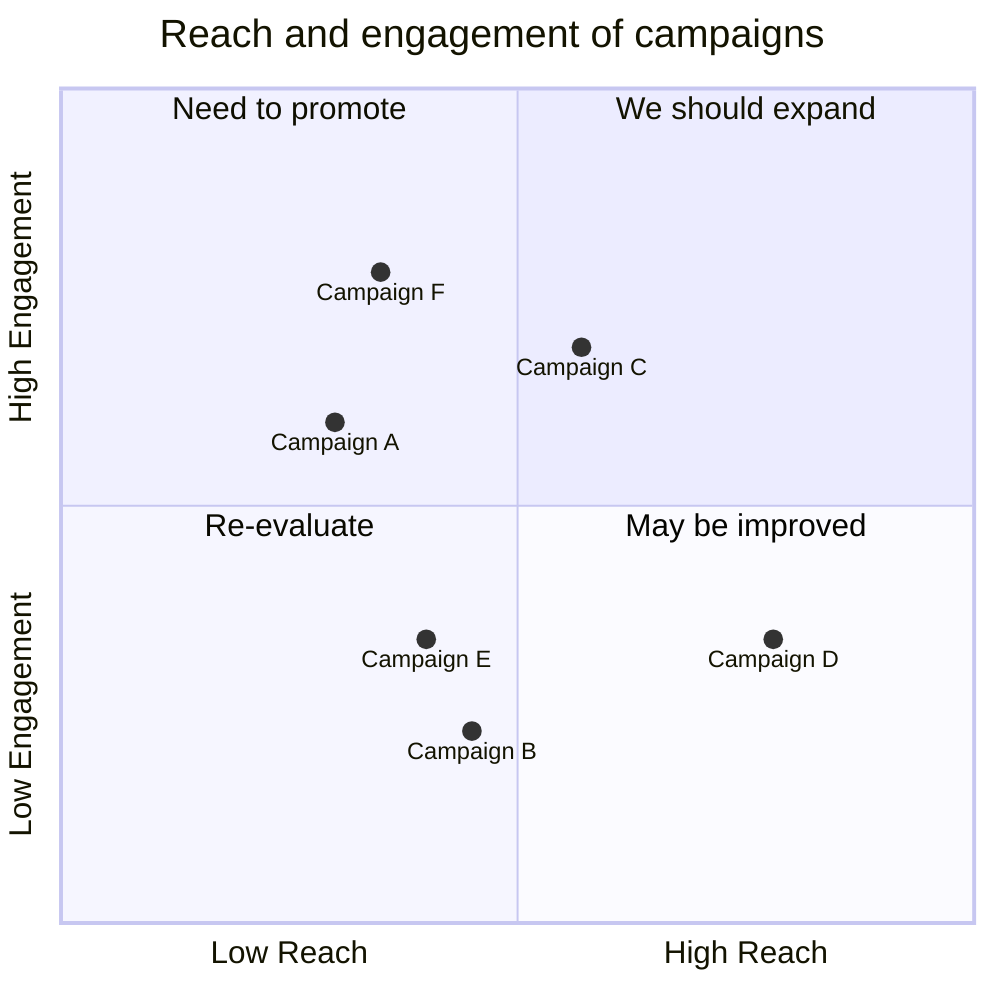


#### 🌳图表配置（quadrantChart）

| 参数                              | 描述                                                      | 默认值 |
| :-------------------------------- | :-------------------------------------------------------- | :----: |
| chartWidth                        | 图表的宽度                                                |  500   |
| chartHeight                       | 图表的高度                                                |  500   |
| titlePadding                      | 标题的顶部和底部填充                                      |   10   |
| titleFontSize                     | 标题字体大小                                              |   20   |
| quadrantPadding                   | 所有象限外的填充                                          |   5    |
| quadrantTextTopPadding            | 当文本绘制在顶部时象限文本顶部填充（那里没有数据点）      |   5    |
| quadrantLabelFontSize             | 象限文本字体大小                                          |   16   |
| quadrantInternalBorderStrokeWidth | 象限内的边框描边宽度                                      |   1    |
| quadrantExternalBorderStrokeWidth | 象限外边框描边宽度                                        |   2    |
| xAxisLabelPadding                 | x 轴文本的顶部和底部填充                                  |   5    |
| xAxisLabelFontSize                | X 轴文本字体大小                                          |   16   |
| xAxisPosition                     | x 轴的位置（顶部、底部）如果有点，则 x 轴将始终渲染在底部 | 'top'  |
| yAxisLabelPadding                 | y 轴文本的左右填充                                        |   5    |
| yAxisLabelFontSize                | Y 轴文本字体大小                                          |   16   |
| yAxisPosition                     | y 轴位置（左、右）                                        | 'left' |
| pointTextPadding                  | 点和下面文本之间的填充                                    |   5    |
| pointLabelFontSize                | 点文本字体大小                                            |   12   |
| pointRadius                       | 要绘制的点的半径                                          |   5    |

#### 🌳图表主题变量（themeVariables）

| 参数                             |        描述        |
| :------------------------------- | :----------------: |
| quadrant1Fill                    | 右上象限的填充颜色 |
| quadrant2Fill                    | 左上象限的填充颜色 |
| quadrant3Fill                    | 左下象限的填充颜色 |
| quadrant4Fill                    | 右下象限的填充颜色 |
| quadrant1TextFill                | 右上象限的文本颜色 |
| quadrant2TextFill                | 左上象限的文本颜色 |
| quadrant3TextFill                | 左下象限的文本颜色 |
| quadrant4TextFill                | 右下象限的文本颜色 |
| quadrantPointFill                |     点填充颜色     |
| quadrantPointTextFill            |     点文本颜色     |
| quadrantXAxisTextFill            |    X 轴文本颜色    |
| quadrantYAxisTextFill            |    Y 轴文本颜色    |
| quadrantInternalBorderStrokeFill |   象限内边框颜色   |
| quadrantExternalBorderStrokeFill |   象限外边框颜色   |
| quadrantTitleFill                |      标题颜色      |

```
%%{init: {"quadrantChart": {"chartWidth": 400, "chartHeight": 400, "yAxisPosition": "right"}, "themeVariables": {"quadrant1TextFill": "#ff0000", "quadrantYAxisTextFill": "#ff0000","quadrantTitleFill":"#ff0000","quadrant3Fill":"#ff0000"}}}%%
quadrantChart
	title quadrantChart
    x-axis Urgent --> Not Urgent
    y-axis Not Important --> "Important ❤"
    quadrant-1 Plan
    quadrant-2 Do
    quadrant-3 Delegate
    quadrant-4 Delete
```

🙌示例：


```mermaid
%%{init: {"quadrantChart": {"chartWidth": 400, "chartHeight": 400, "yAxisPosition": "right"}, "themeVariables": {"quadrant1TextFill": "#ff0000", "quadrantYAxisTextFill": "#ff0000","quadrantTitleFill":"#ff0000","quadrant3Fill":"#ff0000"}}}%%
quadrantChart
    title quadrantChart
    x-axis Urgent --> Not Urgent
    y-axis Not Important --> "Important ❤"
    quadrant-1 Plan
    quadrant-2 Do
    quadrant-3 Delegate
    quadrant-4 Delete
```

---


### 7.思维导图（mindmap）

> 用于将信息直观地组织成层次结构，显示整体各个部分之间的关系。

#### 🌳基本语法

- 设置根级别有一个名为 `Root` 的节点，它有一个子节点 `A`。`A` 又有两个子级 `B` 和 `C`

```
mindmap
Root
    A
      B
      C
```

🙌示例：


```mermaid
mindmap
Root
    A
      B
      C
```

#### 🌳设置不同形状的节点

- 为节点指定形状时，语法与流程图节点类似，其中 id 后跟形状定义，并在形状分隔符内包含文本。

| id样式  |   描述   |
| :-----: | :------: |
|  id[A]  |  正方形  |
|  id(A)  | 圆角方形 |
| id((A)) |   圆圈   |
| id))A(( |    砰    |
|  id)A(  |    云    |
| id{{A}} |  六边形  |

🙌示例：


```mermaid
mindmap
	Root
        id[I am a square]
        id(I am a rounded square)
        id((I am a circle))
        id))I am a bang((
        id)I am a cloud(
        id{{I am a hexagon}}
```

#### 🌳图标

- 可以使用 `::icon()` 语法将它们添加到思维导图节点
- 网址：[Find the Perfect Icon for Your Project in Font Awesome 5 | Font Awesome](https://fontawesome.com/v5/search?o=r&m=free)

```
mindmap
    Root
        A
        ::icon(fa fa-book)
        B(B)
        ::icon(mdi mdi-skull-outline)
```

🙌示例：


```mermaid
mindmap
    Root
        A
        ::icon(fa fa-book)
        B(B)
        ::icon(mdi mdi-skull-outline)
```

#### 🌳字体修改

- 对于粗体文本，请在文本前后使用双星号 `**`
- 对于斜体，请在文本前后使用单个星号 `*`

```
mindmap
    id1["`**Root** with
a second line
Unicode works too: 🤓`"]
      id2["`The dog in **the** hog... a *very long text* that wraps to a new line`"]
      id3[Regular labels still works]
```

🙌示例：


```mermaid
mindmap
    id1["`**Root** with
a second line
Unicode works too: 🤓`"]
      id2["`The dog in **the** hog... a *very long text* that wraps to a new line`"]
      id3[Regular labels still works]
```

---


### 8.时间线图（Timeline Diagram）

> 以图形方式渲染以指示时间的流逝，并且通常按时间顺序组织

#### 🌳基本语法

- 始终以 `timeline` 关键字开头
- 添加第二个冒号，然后添加事件的文本   ` {time period} : {event} `
- 或者可以在每个时间段内拥有一个或多个事件 `{time period} : {event} : {event}`

```
{time period} : {event}
              : {event}
              : {event}
```

```
timeline
    title History of Social Media Platform
    2002 : LinkedIn
    2004 : Facebook
         : Google
    2005 : Youtube
    2006 : Twitter
```

🙌示例：


```mermaid
timeline
    title History of Social Media Platform
    2002 : LinkedIn
    2004 : Facebook
         : Google
    2005 : Youtube
    2006 : Twitter
```

#### 🌳按章节/年龄对时间段进行分组

- 通过添加一行包含关键字 `section` 和后跟部分名称来完成

```
timeline
    title Timeline of Industrial Revolution
    section 17th-20th century
        Industry 1.0 : Machinery, Water power, Steam <br>power
        Industry 2.0 : Electricity, Internal combustion engine, Mass production
        Industry 3.0 : Electronics, Computers, Automation
    section 21st century
        Industry 4.0 : Internet, Robotics, Internet of Things
        Industry 5.0 : Artificial intelligence, Big data,3D printing
```

🙌示例：


```mermaid
timeline
    title Timeline of Industrial Revolution
    section 17th-20th century
        Industry 1.0 : Machinery, Water power, Steam <br>power
        Industry 2.0 : Electricity, Internal combustion engine, Mass production
        Industry 3.0 : Electronics, Computers, Automation
    section 21st century
        Industry 4.0 : Internet, Robotics, Internet of Things
        Industry 5.0 : Artificial intelligence, Big data,3D printing
```

#### 🌳长时间或事件的文本换行

- 如果时间段和事件的文本太长，可以使用 `<br>` 强制换行，避免文本绘制在图表之外

```
timeline
        title England's History Timeline
        section Stone Age
          7600 BC : Britain's oldest known house was built in Orkney, Scotland
          6000 BC : Sea levels rise and Britain becomes an island.<br> The people who live here are hunter-gatherers.
        section Bronze Age
          2300 BC : People arrive from Europe and settle in Britain. <br>They bring farming and metalworking.
                  : New styles of pottery and ways of burying the dead appear.
          2200 BC : The last major building works are completed at Stonehenge.<br> People now bury their dead in stone circles.
                  : The first metal objects are made in Britain.Some other nice things happen. it is a good time to be alive.
```

🙌示例：


```mermaid
timeline
        title England's History Timeline
        section Stone Age
          7600 BC : Britain's oldest known house was built in Orkney, Scotland
          6000 BC : Sea levels rise and Britain becomes an island.<br> The people who live here are hunter-gatherers.
        section Bronze Age
          2300 BC : People arrive from Europe and settle in Britain. <br>They bring farming and metalworking.
                  : New styles of pottery and ways of burying the dead appear.
          2200 BC : The last major building works are completed at Stonehenge.<br> People now bury their dead in stone circles.
                  : The first metal objects are made in Britain.Some other nice things happen. it is a good time to be alive.
```

#### 🌳自定义配色方案

- 使用 `cScale0` 到 `cScale11` 主题变量自定义配色方案
- `cScale0` 变量将驱动第一个部分或时间段的值，`cScale1` 将驱动第二个部分的值，依此类推

```
    %%{init: { 'logLevel': 'debug', 'theme': 'default' , 'themeVariables': {
              'cScale0': '#ff0000', 'cScaleLabel0': '#ffffff',
              'cScale1': '#00ff00',
              'cScale2': '#0000ff', 'cScaleLabel2': '#ffffff'
       } } }%%
       timeline
        title History of Social Media Platform
          2002 : LinkedIn
          2004 : Facebook : Google
          2005 : Youtube
          2006 : Twitter
          2007 : Tumblr
          2008 : Instagram
          2010 : Pinterest
```

🙌示例：


```mermaid
    %%{init: { 'logLevel': 'debug', 'theme': 'default' , 'themeVariables': {
              'cScale0': '#ff0000', 'cScaleLabel0': '#ffffff',
              'cScale1': '#00ff00',
              'cScale2': '#0000ff', 'cScaleLabel2': '#ffffff'
       } } }%%
       timeline
        title History of Social Media Platform
          2002 : LinkedIn
          2004 : Facebook : Google
          2005 : Youtube
          2006 : Twitter
          2007 : Tumblr
          2008 : Instagram
          2010 : Pinterest
```

#### 🌳自定义主题

- `base`
- `forest`
- `dark`
- `default`
- `neutral`

``` 
%%{init: { 'logLevel': 'debug', 'theme': 'base' } }%%
    timeline
        title History of Social Media Platform
          2002 : LinkedIn
          2004 : Facebook : Google
          2005 : Youtube
          2006 : Twitter
          2007 : Tumblr
          2008 : Instagram
          2010 : Pinterest
```


```mermaid
%%{init: { 'logLevel': 'debug', 'theme': 'base' } }%%
    timeline
        title History of Social Media Platform
          2002 : LinkedIn
          2004 : Facebook : Google
          2005 : Youtube
          2006 : Twitter
          2007 : Tumblr
          2008 : Instagram
          2010 : Pinterest
```


```mermaid
%%{init: { 'logLevel': 'debug', 'theme': 'forest' } }%%
    timeline
        title History of Social Media Platform
          2002 : LinkedIn
          2004 : Facebook : Google
          2005 : Youtube
          2006 : Twitter
          2007 : Tumblr
          2008 : Instagram
          2010 : Pinterest
```


```mermaid
%%{init: { 'logLevel': 'debug', 'theme': 'dark' } }%%
    timeline
        title History of Social Media Platform
          2002 : LinkedIn
          2004 : Facebook : Google
          2005 : Youtube
          2006 : Twitter
          2007 : Tumblr
          2008 : Instagram
          2010 : Pinterest
```

---


### 9.桑基图（Sankey diagram）(v10.3.0+)

> 用于描述从一组值到另一组值的流动

#### 🌳基本语法

- 关键字`sankey-beta` ，可以直接复制粘贴`CSV`文件内容进行操作
- `CSV` 必须仅包含 3 列，`source`、`target` 和 `value`：

```
sankey-beta
    %% source,target,value
    Electricity grid,Over generation / exports,104.453
    Electricity grid,Heating and cooling - homes,113.726
    Electricity grid,H2 conversion,27.14
```

🙌示例：


```mermaid
sankey-beta
    %% source,target,value
    Electricity grid,Over generation / exports,104.453
    Electricity grid,Heating and cooling - homes,113.726
    Electricity grid,H2 conversion,27.14
```

```text
---
config:
  sankey:
    showValues: false
---
sankey-beta
    Agricultural 'waste',Bio-conversion,124.729
    Bio-conversion,Liquid,0.597
    Bio-conversion,Losses,26.862
    Bio-conversion,Solid,280.322
    Bio-conversion,Gas,81.144
    Biofuel imports,Liquid,35
    Biomass imports,Solid,35
    Coal imports,Coal,11.606
    Coal reserves,Coal,63.965
    Coal,Solid,75.571
    District heating,Industry,10.639
    District heating,Heating and cooling - commercial,22.505
    District heating,Heating and cooling - homes,46.184
    Electricity grid,Over generation / exports,104.453
    Electricity grid,Heating and cooling - homes,113.726
    Electricity grid,H2 conversion,27.14
    Electricity grid,Industry,342.165
    Electricity grid,Road transport,37.797
    Electricity grid,Agriculture,4.412
    Electricity grid,Heating and cooling - commercial,40.858
    Electricity grid,Losses,56.691
    Electricity grid,Rail transport,7.863
    Electricity grid,Lighting & appliances - commercial,90.008
    Electricity grid,Lighting & appliances - homes,93.494
    Gas imports,Ngas,40.719
    Gas reserves,Ngas,82.233
    Gas,Heating and cooling - commercial,0.129
    Gas,Losses,1.401
    Gas,Thermal generation,151.891
    Gas,Agriculture,2.096
    Gas,Industry,48.58
    Geothermal,Electricity grid,7.013
    H2 conversion,H2,20.897
    H2 conversion,Losses,6.242
    H2,Road transport,20.897
    Hydro,Electricity grid,6.995
    Liquid,Industry,121.066
    Liquid,International shipping,128.69
    Liquid,Road transport,135.835
    Liquid,Domestic aviation,14.458
    Liquid,International aviation,206.267
    Liquid,Agriculture,3.64
    Liquid,National navigation,33.218
    Liquid,Rail transport,4.413
    Marine algae,Bio-conversion,4.375
    Ngas,Gas,122.952
    Nuclear,Thermal generation,839.978
    Oil imports,Oil,504.287
    Oil reserves,Oil,107.703
    Oil,Liquid,611.99
    Other waste,Solid,56.587
    Other waste,Bio-conversion,77.81
    Pumped heat,Heating and cooling - homes,193.026
    Pumped heat,Heating and cooling - commercial,70.672
    Solar PV,Electricity grid,59.901
    Solar Thermal,Heating and cooling - homes,19.263
    Solar,Solar Thermal,19.263
    Solar,Solar PV,59.901
    Solid,Agriculture,0.882
    Solid,Thermal generation,400.12
    Solid,Industry,46.477
    Thermal generation,Electricity grid,525.531
    Thermal generation,Losses,787.129
    Thermal generation,District heating,79.329
    Tidal,Electricity grid,9.452
    UK land based bioenergy,Bio-conversion,182.01
    Wave,Electricity grid,19.013
    Wind,Electricity grid,289.366
```


```mermaid
---
config:
  sankey:
    showValues: false
---
sankey-beta

    Agricultural 'waste',Bio-conversion,124.729
    Bio-conversion,Liquid,0.597
    Bio-conversion,Losses,26.862
    Bio-conversion,Solid,280.322
    Bio-conversion,Gas,81.144
    Biofuel imports,Liquid,35
    Biomass imports,Solid,35
    Coal imports,Coal,11.606
    Coal reserves,Coal,63.965
    Coal,Solid,75.571
    District heating,Industry,10.639
    District heating,Heating and cooling - commercial,22.505
    District heating,Heating and cooling - homes,46.184
    Electricity grid,Over generation / exports,104.453
    Electricity grid,Heating and cooling - homes,113.726
    Electricity grid,H2 conversion,27.14
    Electricity grid,Industry,342.165
    Electricity grid,Road transport,37.797
    Electricity grid,Agriculture,4.412
    Electricity grid,Heating and cooling - commercial,40.858
    Electricity grid,Losses,56.691
    Electricity grid,Rail transport,7.863
    Electricity grid,Lighting & appliances - commercial,90.008
    Electricity grid,Lighting & appliances - homes,93.494
    Gas imports,Ngas,40.719
    Gas reserves,Ngas,82.233
    Gas,Heating and cooling - commercial,0.129
    Gas,Losses,1.401
    Gas,Thermal generation,151.891
    Gas,Agriculture,2.096
    Gas,Industry,48.58
    Geothermal,Electricity grid,7.013
    H2 conversion,H2,20.897
    H2 conversion,Losses,6.242
    H2,Road transport,20.897
    Hydro,Electricity grid,6.995
    Liquid,Industry,121.066
    Liquid,International shipping,128.69
    Liquid,Road transport,135.835
    Liquid,Domestic aviation,14.458
    Liquid,International aviation,206.267
    Liquid,Agriculture,3.64
    Liquid,National navigation,33.218
    Liquid,Rail transport,4.413
    Marine algae,Bio-conversion,4.375
    Ngas,Gas,122.952
    Nuclear,Thermal generation,839.978
    Oil imports,Oil,504.287
    Oil reserves,Oil,107.703
    Oil,Liquid,611.99
    Other waste,Solid,56.587
    Other waste,Bio-conversion,77.81
    Pumped heat,Heating and cooling - homes,193.026
    Pumped heat,Heating and cooling - commercial,70.672
    Solar PV,Electricity grid,59.901
    Solar Thermal,Heating and cooling - homes,19.263
    Solar,Solar Thermal,19.263
    Solar,Solar PV,59.901
    Solid,Agriculture,0.882
    Solid,Thermal generation,400.12
    Solid,Industry,46.477
    Thermal generation,Electricity grid,525.531
    Thermal generation,Losses,787.129
    Thermal generation,District heating,79.329
    Tidal,Electricity grid,9.452
    UK land based bioenergy,Bio-conversion,182.01
    Wave,Electricity grid,19.013
    Wind,Electricity grid,289.366
```

#### 🌳配置

- 自定义链接颜色、节点对齐方式和图表尺寸，推荐在配置文件`index.html`中进行修改
- 你可以通过将 `linkColor` 设置为以下之一来调整链接的颜色：
  - `source` - 链接将具有源节点颜色
  - `target` - 链接将具有目标节点颜色
  - `gradient` - 链接颜色将在源节点颜色和目标节点颜色之间平滑过渡
  - 颜色的十六进制代码，如 `#a1a1a1`

```javascript
<script>
  const config = {
    startOnLoad: true,//Mermaid将自动开始渲染图表
    securityLevel: 'loose',//设置Mermaid的安全级别为'loose'
    sankey: {
      width: 800,
      height: 400,
      linkColor: 'source',//调整链接的颜色
      nodeAlignment: 'left',//图形布局justify，center，left，right
    },
  };
  mermaid.initialize(config);//调用Mermaid的initialize方法，并传入上面定义的config对象作为参数。
</script>
```

---


### 10.XY 图表（柱状图和折线图）

#### 🌳基本语法

- `xychart-beta` 可以水平或垂直绘制，默认值为垂直vertical，可改水平horizontal
- `x-axis`
- `y-axis`
- `bar`  **柱状图**
- `line`  **折线图**

```
xychart-beta vertical
    title "Sales Revenue"
    x-axis "month" [jan, feb, mar, apr, may, jun, jul, aug, sep, oct, nov, dec]
    y-axis "Revenue (in $)" 4000 --> 11000
    bar [5000, 6000, 7500, 8200, 9500, 10500, 11000, 10200, 9200, 8500, 7000, 6000]
    line [5000, 6000, 7500, 8200, 9500, 10500, 11000, 10200, 9200, 8500, 7000, 6000]
```

🙌示例：


```mermaid
xychart-beta vertical
    title "Sales Revenue"
    x-axis "month" [jan, feb, mar, apr, may, jun, jul, aug, sep, oct, nov, dec]
    y-axis "Revenue (in $)" 4000 --> 11000
    bar [5000, 6000, 7500, 8200, 9500, 10500, 11000, 10200, 9200, 8500, 7000, 6000]
    line [5000, 6000, 7500, 8200, 9500, 10500, 11000, 10200, 9200, 8500, 7000, 6000]
```

#### 🌳图表配置（Chart Configurations）

| 参数                     | 描述                       |   默认值   |
| :----------------------- | :------------------------- | :--------: |
| width                    | 图表的宽度                 |    700     |
| height                   | 图表的高度                 |    500     |
| titlePadding             | 标题的顶部和底部填充       |     10     |
| titleFontSize            | 标题字体大小               |     20     |
| showTitle                | 标题是否显示               |    true    |
| xAxis                    | x 轴配置                   | AxisConfig |
| yAxis                    | y 轴配置                   | AxisConfig |
| chartOrientation         | 'vertical' 或 'horizontal' | 'vertical' |
| plotReservedSpacePercent | 最小空间图将占据图表内部   |     50     |

#### 🌳坐标轴配置（AxisConfig）

| 参数          | 描述                   | 默认值 |
| :------------ | :--------------------- | :----: |
| showLabel     | 显示轴标签或刻度值     |  true  |
| labelFontSize | 要绘制的标签的字体大小 |   14   |
| labelPadding  | 标签的顶部和底部填充   |   5    |
| showTitle     | 是否显示轴标题         |  true  |
| titleFontSize | 轴标题字体大小         |   16   |
| titlePadding  | 轴标题的顶部和底部填充 |   5    |
| showTick      | 勾选是否显示           |  true  |
| tickLength    | 刻度线会持续多长时间   |   5    |
| tickWidth     | 刻度线的宽度是多少     |   2    |
| showAxisLine  | 轴线是否显示           |  true  |
| axisLineWidth | 轴线粗细               |   2    |

#### 🌳图表主题变量（Chart Theme Variables）

| 参数             | 描述                                          |
| :--------------- | :-------------------------------------------- |
| backgroundColor  | 整个图表的背景颜色                            |
| titleColor       | 标题文本的颜色                                |
| xAxisLableColor  | x 轴标签的颜色                                |
| xAxisTitleColor  | x 轴标题的颜色                                |
| xAxisTickColor   | x 轴刻度线的颜色                              |
| xAxisLineColor   | x 轴线的颜色                                  |
| yAxisLableColor  | y 轴标签的颜色                                |
| yAxisTitleColor  | y 轴标题的颜色                                |
| yAxisTickColor   | y 轴刻度的颜色                                |
| yAxisLineColor   | y 轴线的颜色                                  |
| plotColorPalette | 用逗号分隔的颜色字符串，例如 "#f3456, #43445" |

🙌示例：

```
---
config:
    xyChart:
        width: 900
        height: 600
        titleFontSize: 30
        tickWidth: 5
    themeVariables:
        xyChart:
            backgroundColor: "#C0C0C0"
            titleColor: "#ff0000"
            yAxisTitleColor: "#800080"
            xAxisLineColor: "#FFC0CB"
            xAxisLableColor: "#008080"
---
xychart-beta vertical
    title "Sales Revenue"
    x-axis "month" [jan, feb, mar, apr, may, jun, jul, aug, sep, oct, nov, dec]
    y-axis "Revenue (in $)" 4000 --> 11000
    bar [5000, 6000, 7500, 8200, 9500, 10500, 11000, 10200, 9200, 8500, 7000, 6000]
    line [5000, 6000, 7500, 8200, 9500, 10500, 11000, 10200, 9200, 8500, 7000, 6000]
```


```mermaid
---
config:
    xyChart:
        width: 900
        height: 600
        titleFontSize: 30
        tickWidth: 5
    themeVariables:
        xyChart:
            backgroundColor: "#C0C0C0"
            titleColor: "#ff0000"
            yAxisTitleColor: "#FF00FF"
            xAxisLineColor: "#FFC0CB"
            xAxisLableColor: "#008000"
---
xychart-beta vertical
    title "Sales Revenue"
    x-axis "month"[jan, feb, mar, apr, may, jun, jul, aug, sep, oct, nov, dec]
    y-axis "Revenue (in $)" 4000 --> 11000
    bar [5000, 6000, 7500, 8200, 9500, 10500, 11000, 10200, 9200, 8500, 7000, 6000]
    line [5000, 6000, 7500, 8200, 9500, 10500, 11000, 10200, 9200, 8500, 7000, 6000]
```

---


> mermaid语法参考Mermaid中文网[Mermaid中文网]([教程 | Mermaid 中文网 (nodejs.cn)](https://mermaid.nodejs.cn/ecosystem/tutorials.html))

