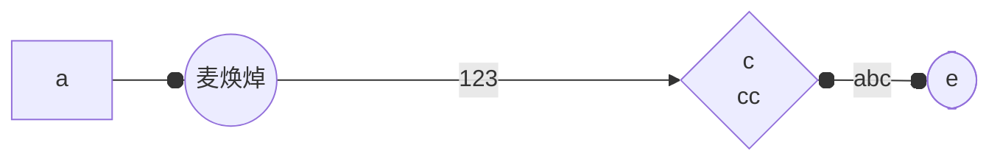
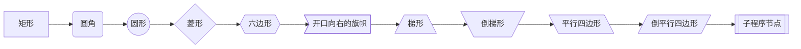
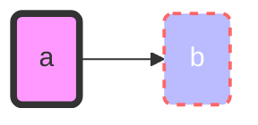
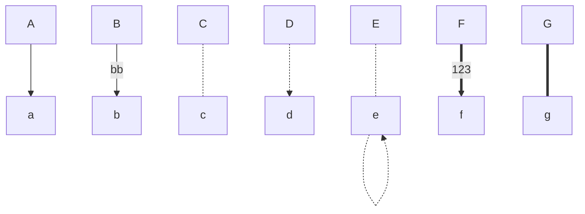
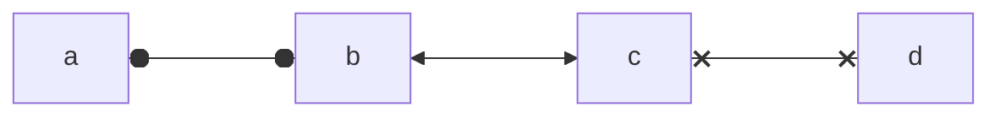
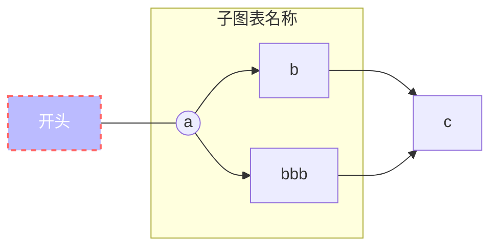
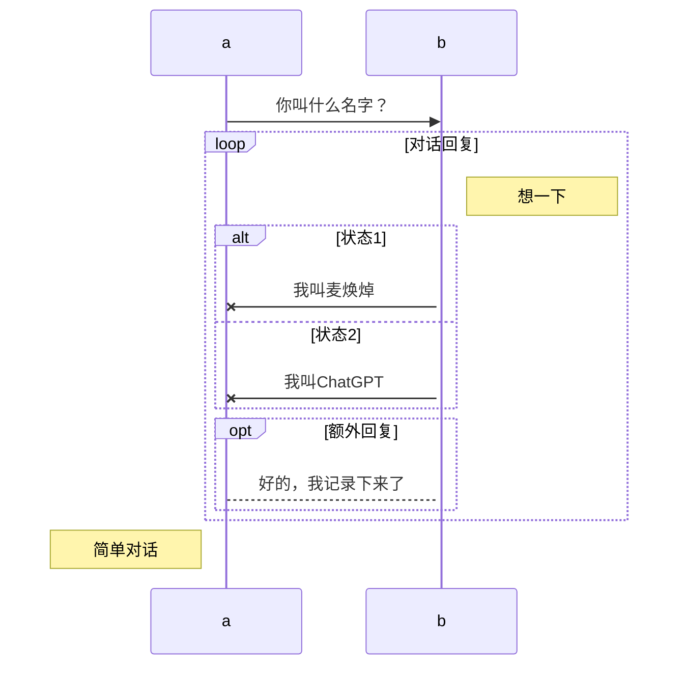

------

<h1 align = "center">markdown基本语法🚀</h1>

<div style="text-align: right; color: Purple; font-size: 18px;">
    <span style="font-weight: bold; font-style: italic; text-decoration: underline;">
        <a href="https://github.com/kestlermai" style="color: Purple;">--by:maihuanzhuo</a>
    </span>
</div>

## 一、标题

> 快捷键：ctrl+数字=标题级别

|  命令  |   描述   |
| :----: | :------: |
|   #    | 一级标题 |
|   ##   | 二级标题 |
|  ###   | 三级标题 |
|  ####  | 四级标题 |
| #####  | 五级标题 |
| ###### | 六级标题 |

---

## 二、引用

> 命令：'>'加上引用内容；快捷键：Ctrl + Shift + Q ；退出引用：Shift + Tab

🙌示例：

> 这是麦焕焯的笔记

也可以多重嵌套引用：

🙌示例：

```tex
>这是麦焕焯的笔记

>这是麦焕焯的笔记
>>这是麦焕焯的笔记
>>>这是麦焕焯的笔记
```

🙌效果：

> 这是麦焕焯的笔记

>这是麦焕焯的笔记
>
>> 这是麦焕焯的笔记
>>
>>> 这是麦焕焯的笔记

---

## 三、列表

### 1.有序列表

> 命令：用'1.','2.'.....表示，快捷键：Ctrl + Shift + [
>
> 降级快捷键：Tab 或 Shift + ]
>
> 升级快捷键：Shift + Tab 或 Shift + [

🙌安装R studio步骤：

1. 安装r-base
2. 安装r-studio
3. 安装rtools

### 2.无序列表

> 命令：用’-‘或者’*‘加空格表示，快捷键：Ctrl + Shift + ]

🙌安装R studio步骤：

- 安装r-base

- 安装r-studio

- 安装rtools


> 同时也可以展现不同子列表：用多个’-‘或者’*‘加空格表示，快捷键：Shift + Tab 或 Shift + ]

🙌安装R studio步骤：

* 安装r-base
* * 安装r-studio

* * * 安装rtools

> 如果想结束有序或无序列表，用 Ctrl + ] 即可

🙌安装R studio步骤：

* 安装r-base
* -  安装r-studio
  - - 安装rtools

结束

### 3.任务列表

> 命令：- [ ] ，快捷键：Ctrl + Shift + X

🙌安装R studio步骤：

- [x] 安装r-base

- [x] 安装r-studio

- [x] 安装rtools

---

## 四、表格

> 命令：|xx|xx|xx|
>
> 左对齐：|:---|:---|:---|
>
> 右对齐：|---:|---:|---:|
>
> 居中：|:---:|:---:|:---:|

```tex
|日期|地点|纬度|
|:---:|:---:|:---:|
|2021-01-19|北京|北纬39.4|
|2022-02-19|上海|北纬31.1|
|2023-03-19|广州|北纬22.3|
|2024-04-19|深圳|北纬22.3|
```

|    日期    | 地点 |   纬度   |
| :--------: | :--: | :------: |
| 2021-01-19 | 北京 | 北纬39.4 |
| 2022-02-19 | 上海 | 北纬31.1 |
| 2023-03-19 | 广州 | 北纬22.3 |
| 2024-04-19 | 深圳 | 北纬22.3 |

- [x] 快捷键：Ctrl + T
- [x] 添加行：Ctrl + Enter
- [x] 删除行：Ctrl + Shift + Backspace（即删除键，左的箭头"←"）
- [x] `Alt` + `↑`   将表格该行上移，`↓` 将该行下移
- [x] `Alt` + `←`   将表格该列左移，`→` 将该列右移

---

## 五、代码

### 1.代码块

> 命令：```，快捷键：Ctrl + Shift + K，退出快捷键：Ctrl + Enter

```c
#include<stdio.h>
int main()
{
    printf("hello world!\n");
    return 0;
}
```

### 2.行内代码

> 命令：\`代码\` ; 快捷键：Ctrl + Shift + `

`print("hello world!") `

---

## 六、数学公式

### 1.公式块

> 命令： “$$” + 回车；快捷键：Ctrl + Shift + M

```tex
$$
e^{i\pi + 1} = 2
$$
```


$$
e^{i\pi + 1} = 2
$$

### 2.行内公式

> 命令： “$ $”

```tex
$ e^{i\pi + 1} = 2 \$
```

$ e^{i\pi + 1} = 2 $

---

## 七、元素

### 1.插入图片

> 命令： \!\[图片名词]\(图片路径)；快捷键：Ctrl + Shift + I

```tex
示例：
```


#### 🌳修改图片大小

> 使用代码插入：\    # 拷贝url后，更改width与height即可

### 2.超链接

> 命令： \[显示内容](网址) ; 快捷键：Ctrl + K

```tex
示例：[GitHub](https://github.com/)  [ChatGPT (openai.com)](https://chat.openai.com/)
```

[GitHub](https://github.com/) [ChatGPT (openai.com)](https://chat.openai.com/)

- [x] 打开网站：Ctrl + 左键单击（在typora下）

### 3.引用链接

> 命令： \[显示内容][引用路径]
>
> [引用：路径 "描述"    /* typora下点击链接的时候需要按ctrl键 */

```tex
示例： [maomao][maomao]
[maomao]:C:\Users\maihuanzhuo\Desktop\猫猫.jpg"maomao"
```

[maomao][maomao]

[maomao]: C:\Users\maihuanzhuo\Desktop\猫猫.jpg "maomao"

### 4.水平分割线

> 命令： --- ； 

---

## 八、样式

### 1.字体加粗

> 命令：\**加粗** 或者 \__加粗__； 快捷键：Ctrl + B

🙌示例：**麦焕焯**

### 2.字体斜体

> 命令：\*斜体* 或者 \_斜体_；快捷键：Ctrl + I ；快捷键：Ctrl + I

🙌示例：*麦焕焯*

> 字体加粗+斜体 ：\*\*\*文字*** 或者 \_\_\_文字___   

🙌示例：***麦焕焯***

### 3.字体高亮

> 命令： \=\=高亮== ; 

🙌示例：==麦焕焯==

### 4.下划线

> 命令： \<u>下划线内容</u>    快捷键：Ctrl + U

🙌示例：<u>麦焕焯</u>

### 5.删除线

> 命令：\~\~删除线内容~~      快捷键：Alt + Shift + 5

🙌示例：~~麦焕焯~~

### 6.下标

> 命令： \~小标内容~ 

🙌示例：H~2~O

### 7.上标

> 命令：\^上标内容^

🙌示例：x^2^

### 8.添加表情

> 命令：\:smile:  快捷键：win + 句号

🙌示例：😂🤣❤️😍😘💕😁👍🙌👌

### 9.脚注（尾注）

> 命令：\[^xx]

```tex
麦焕焯[^xx]
[^xx]:这是脚注内容
```

🙌示例：

麦焕焯[^xx]

[^xx]:这是脚注内容

### 10.字体颜色

> 命令： \$\textcolor{颜色名称}{字符}$

```tex
示例：$\textcolor{GreenYellow}{麦焕焯}$
```

$\textcolor{GreenYellow}{麦焕焯}$

> typora字体配色模板引用自：https://blog.csdn.net/liulei952413829/article/details/114670380

### 11.换行

> 命令：\<br> 或者直接空格回车键也可以

🙌示例：

麦<br>焕焯

### 12.标题和文字居中

> 命令： \<h1 align = "center">标题居中</h1>  #可选left（默认）、right、center

🙌示例：

 <h1 align = "center">标题居中</h1> 

> 命令： \<center>文字居中</center>   #但是html中没有\<right>命令

```html
<div style="text-align: right; color: Purple; font-size: 20px;">
    <span style="font-weight: bold; font-style: italic; text-decoration: underline;">
        文字偏左
    </span>
</div>
```

🙌示例：

<div style="text-align: right; color: Purple; font-size: 16px;">
    <span style="font-weight: bold; font-style: italic; text-decoration: underline;">
        文字偏左
    </span>
</div>

---

## 九、绘图（mermaid语法）

~~~tex
用法：
```mermaid
    #此处内容会渲染成mermaid图形
```
或者直接在代码块定义mermaid语法
~~~

### 1.流程图（graph or flowchart）

> 使用***graph***或***flowchart***关键字来定义流程图

🙌示例：

````

````


#### 🌳流程图方向

|   样式   |              描述               |
| :------: | :-----------------------------: |
| graph TB | top to bottom（从上到下，默认） |
| graph TD |    top-down（也是从上到下）     |
| graph BT |    bottom to top（从下到上）    |
| graph RL |    right to left（从右到左）    |
| graph LR |    left to right（从左到右）    |

#### 🌳结点样式

|  id样式   |                描述                |
| :-------: | :--------------------------------: |
|   id[A]   |          矩形结点（默认）          |
|   id(A)   | 圆角矩形结点（也可以叫圆角矩形框） |
|  id((A))  |              圆形结点              |
|   id{A}   |              棱形结点              |
|  id{{A}}  |             六边形结点             |
|  id >A]   |         开口向右的旗帜结点         |
| id[/A\\]  |                梯形                |
|  id[\A/]  |               倒梯形               |
| id[\\A\\] |             平行四边形             |
|  id[/A/]  |           反向平行四边形           |
|  id[[A]]  |             子程序节点             |




#### 🌳自定义节点样式

```tex
graph LR
	a(a) --> b(b)
	style a fill:#f9f,stroke:#333,stroke-width:4px
	style b fill:#bbf,stroke:#f66,stroke-width:2px,color:#fff,stroke-dasharray:5 5
```




#### 🌳连接线样式

| 线的样式 |              含义              |
| :------: | :----------------------------: |
|   -->    | 带箭头的实线（短线越多线越长） |
| --aa-->  |       中间可以添加文字aa       |
|  - . -   |     虚线 （虚线不能延长）      |
|  - . ->  |       虚线 （不能延长）        |
| -.- -.-> | 中间可以添加文字 （不能延长）  |
|   ==>    |     带箭头的粗线（可延长）     |
|   ===    |        粗线 （可延长）         |




- [x] `|文本|`：表示条件分支的判断条件和文本

#### 🌳连接头样式

```
graph LR
	a o---o b
	b <---> c
	c x---x d
```




#### 🌳子图表（subgraph）

```
graph LR
	开头 --- a((a))
	subgraph 子图表名称
		a --> b
		a --> bbb
	end
	b --> c
	bbb --> c
	style 开头 fill:#bbf,stroke:#f66,stroke-width:2px,color:#fff,stroke-dasharray:5 5
```




### 2.序列图（sequenceDiagram）

>  sequenceDiagram：描述对象之间交互顺序的图表

#### 🌳常见语法

- [x] `:` 表示消息的内容
- [x] `->>` 表示从左到右的箭头
- [x] `-->>` 用于时序图中的回复内容
- [x] `--x` 末端为叉的实线或虚线（表示异步）
- [x] `Note` 用于添加注释，right of，left of，over（在当中，可以横跨多个参与者）
- [x] `activate` 参与者，说明某个参与者进入“处理中”状态
- [x] 在消息线末尾增加 `+` ，则消息接收者进入当前消息的“处理中”状态；
- [x] 在消息线末尾增加 `-` ，则消息接收者离开当前消息的“处理中”状态。

#### 🌳循环

```
loop 循环的条件
    循环体描述语句
end
```

#### 🌳判断

```
alt 条件 1 描述
    分支 1 描述语句
else 条件 2 描述 # else 分支可选
    分支 2 描述语句
else ...
    ...
end
```

#### 🌳可选情况

```
opt 条件描述
    分支描述语句
end
```

🙌示例：

```
sequenceDiagram
	a ->> b: 你叫什么名字？
	loop 对话回复
		activate b
		Note right of b: 想一下
		alt 状态1
		b -x a: 我叫麦焕焯
		else 状态2
		b -x a: 我叫ChatGPT
		end
		opt 额外回复
        a --> b: 好的，我记录下来了
		end
	end
	Note left of a: 简单对话
```




### 3.类图

> classDiagram 用于展示系统中的类及其之间的关系
